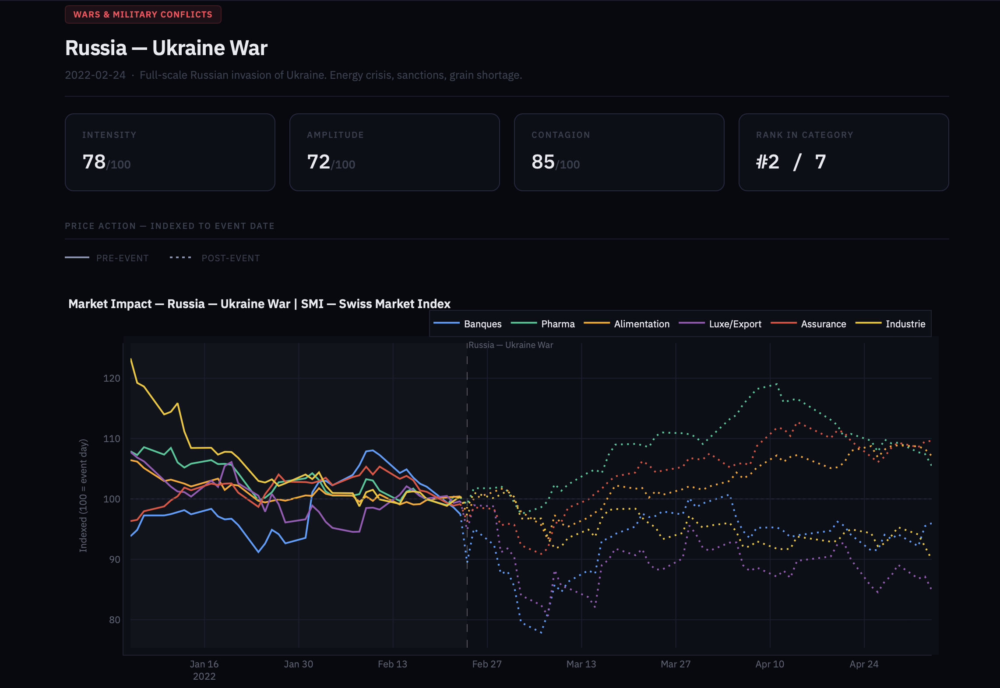

# 🌍 AlpineShock — Global Market Impact Analyzer

> Quantify the effect of geopolitical shocks on financial markets.

A Streamlit-based interactive dashboard that analyzes how major geopolitical and macroeconomic events have historically affected global financial markets — covering the SMI, S&P 500, and NASDAQ since 1990.

---

## Features

- **Impact Analysis** — Visualize normalized price impact across 3 indices and key sectors
- **Shock Profile** — Horizontal bar chart showing relative sector sensitivity
- **35+ historical events** — From Black Monday (1987) to recent geopolitical crises
- **Normalized time series** — Prices indexed to 5-day pre-event average
- **Methodology tab** — Transparent explanation of data sources and scoring logic

---

## Stack

| Tool | Usage |
|------|-------|
| Python 3.14 | Core language |
| Streamlit | Web app framework |
| Plotly | Interactive charts |
| yfinance | Real market data |
| pandas | Data manipulation |

---

## Run Locally
```bash
git clone https://github.com/zacharyrognon05-alt/alpineshock.git
cd alpineshock
pip install streamlit plotly yfinance pandas
streamlit run app.py
```

---

## Project Structure---

*Built by Zach Rognon — International Economics student, Switzerland*